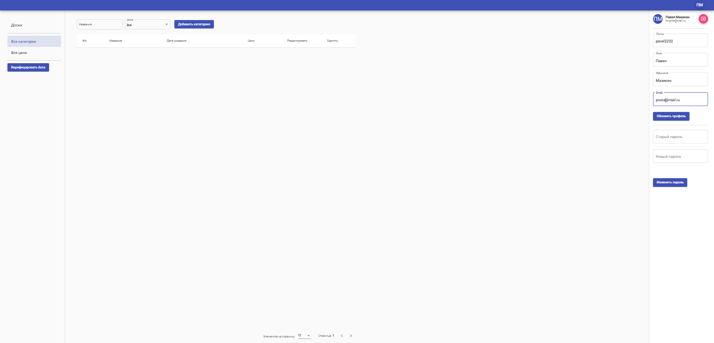

# ✏️🗒 Планер задач | Todoist | Python, Django, Postgressql, Swagger
Самый популярный планировщик задач. Задачи могут также содержать заметки с файлами любого типа. Задачи можно помещать в проекты, сортировать по фильтрам, присваивать им метки, редактировать.
приложения для управления персональными и рабочими задачами.


## Как запустить
* склонируйте репозиторий ``` git clone https://github.com/Pavel2232/Todoist-App  ```
* установите зависимости проекта ```poetry init ```
* заполните .env по аналогии с [.env.example](.env.example)
* выполните ```./manage.py makemigrations```
* выполните ```./manage.py migrate```
* выполните ```./manage.py runserver```

## Как запустить через Docker
* склонируйте репозиторий ``` git clone https://github.com/Pavel2232/Todoist-App  ```
* заполните .env по аналогии с [.env.example](.env.example)
* выполните ```docker compose up -d ```

## Что реализовано в этом проекте
- [x]  Все методы приложения полностью идентичны эталонному swagger.
- [x]  Корректно работает функционал досок.
- [x]  Корректно работает система доступов (владелец, редактор, читатель).
- [x]  Пользователю не выводится чужая информация (из тех досок, в которых он не является участником).
- [x]  Создание/просмотр/редактирование/удаление категори/целей/комментариев
- [x]  регистрация, вход/выход,
- [x]  получение и обновление профиля,
- [x]  смена пароля,
- [x]  вход через социальную сеть VK.
- [x]  всевозможная фильтрация  
## Настроена автоматическая сборка и деплой приложения на сервер:
- [x]  Создан dockerfile для нашего Django-приложения
- [x]  Создан docker-compose.yaml.
- [x]  Создан файл .github/actions/action.yaml с описанием сборки и деплоя приложения.
- [x]  Аккаунт Telegram привязан к аккаунту приложения, через Telegram получается просматривать все открытые цели пользователя, создавать цели.
Код иммеет 20 автотестов с использованием factoryboy
